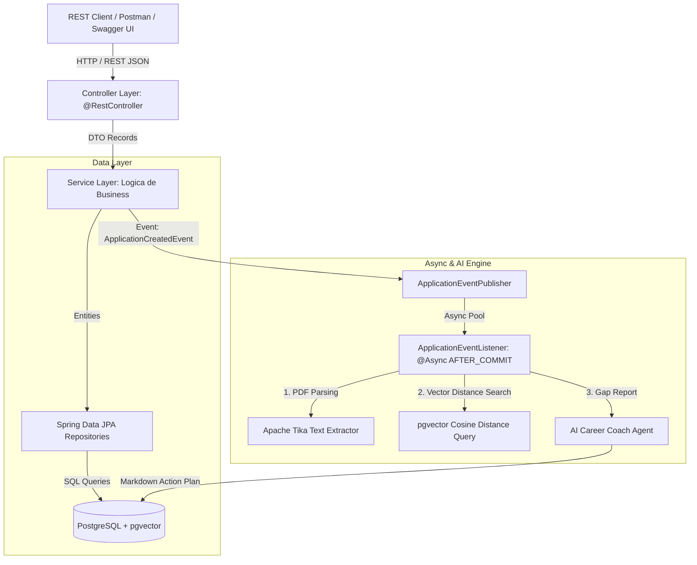

# 🚀 AI-Powered Job Tracker & ATS Matcher Engine


> **Sistem Backend Enterprise** conceput pentru gestionarea eficientă a aplicațiilor de angajare, extragerea automată a textului din CV-uri PDF cu Apache Tika, căutarea semantică vectorială prin `pgvector` și generarea asincronă de rapoarte AI Gap Analysis și planuri de acțiune.

---

## 🏗️ Arhitectura Sistemului



---

## ✨ Caracteristici Cheie

* **PDF Text Extraction Engine:** Extragerea automată a textului din fișiere PDF/Word încărcate folosind **Apache Tika**.
* **Vector Embeddings & Semantic Search:** Stocarea vectorilor în PostgreSQL și calculul instant al similarității semantice dintre CV și descrierea jobului prin operatorul Cosine Distance (`<=>`) din **`pgvector`** și indecși **HNSW**.
* **Arhitectură Event-Driven Asincronă:** Procesarea analizelor AI în fundal prin `@Async` și `@TransactionalEventListener(phase = AFTER_COMMIT)` fără a bloca firul principal HTTP (răspunsuri REST sub 50ms).
* **Spring Boot 3 & Java 21 Records:** Utilizarea DTO-urilor imutabile moderne, validare declarativă cu Jakarta Validation și arhitectură pe straturi (Controller-Service-Repository).
* **Tratarea Globală a Erorilor (RFC-7807):** Răspunsuri de eroare standardizate de tip `ProblemDetail`.
* **Automated CI/CD Pipeline:** Pipeline integrat în **GitHub Actions** care execută automat testele la fiecare `git push`.
* **OpenAPI / Swagger UI:** Interfață vizuală interactivă pentru testarea API-urilor direct din browser.

---

## 🛠️ Stack Tehnologic

* **Core:** Java 21, Spring Boot 3.3.2
* **Persistence & DB:** Spring Data JPA, Hibernate 6, PostgreSQL 16, `pgvector`, Flyway Migrations
* **AI & Document Parsing:** Apache Tika 2.9.2, PGVector Cosine Similarity
* **Testing & Tools:** JUnit 5, Mockito, Lombok, Docker, Docker Compose
* **Documentation & CI/CD:** SpringDoc OpenAPI 3.0, GitHub Actions

---

## 🚦 Ghid de Rulare Quickstart

### 1. Prerechizite
* Java 21 JDK instalat
* Docker & Docker Desktop pornit

### 2. Pornirea Bazei de Date cu Docker Compose
```bash
docker compose up -d
```

### 3. Pornirea Aplicației Spring Boot
```bash
mvn spring-boot:run
```
*Flyway va crea automat schema bazei de date și va insera utilizatorul demo.*

---

## 📖 Documentația API Interactive (Swagger UI)

După ce aplicația a pornit, accesează în browser interfața vizuală Swagger UI:
👉 **[http://localhost:8080/swagger-ui.html](http://localhost:8080/swagger-ui.html)**

### Endpoints Principale:
* `POST /api/v1/jobs` — Salvează un job nou
* `POST /api/v1/resumes` — Încarcă un CV în format PDF/DocX (Multipart)
* `POST /api/v1/applications` — Creează o aplicație nouă și declanșează procesarea asincronă AI
* `POST /api/v1/applications/{id}/analysis` — Generează raportul AI Gap Analysis

---

## 🧪 Rularea Testelor Automate

```bash
mvn clean test
```

---

## 👤 Autor
**Alexandru Sîrbu** — *Junior Backend Developer*
* GitHub: [@sirbumihai](https://github.com/sirbumihai)
* LinkedIn: [sirbu-mihai](https://www.linkedin.com/in/sirbu-mihai-86133b181/)
